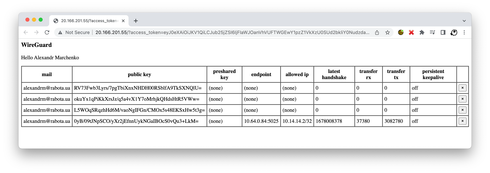

# WireGuard, Azure, Kubernetes, Active Directory

Goal: passwordless WireGuard VPN running inside Azure AKS Kubernetes cluster with ephemeral secrets and clients connecting via Azure Active Directory



Things to watch out:

- no secrets passed, shared, stored, transferred - so nothing to hide and nothing to rotate
- everything is ephemeral which means even if something will be exposed it will become dead sooner that will be discovered
- thanks to azure private networks we are not only inside the Kubernetes and can talk to services running inside but as well to other servers in same network
- because of coredns we may configure everything in a such a way that we will be talking to ingress internal address while connected

[How does AAD approach works?](https://www.reddit.com/r/selfhosted/comments/11iuxf3/comment/jb0kzoj/?utm_source=reddit&utm_medium=web2x&context=3)

<details>
<summary>How does WireGuard works?</summary>

In short WireGuard is build into the kernel and just works out of the box so there is no need to do something special about it. [Here](https://mac-blog.org.ua/kubernetes-wireguard/) you may found few examples of how you can get it up and running, but in simplest case it will be as easy as:

```bash
cat <<EOF | kubectl apply -f -
---
apiVersion: v1
kind: Pod
metadata:
  name: demo
  labels:
    app: demo
spec:
  nodeSelector:
    kubernetes.io/os: linux
  containers:
    - name: demo
      image: nginx:alpine
      securityContext:
        capabilities:
          add:
            - NET_ADMIN
---
apiVersion: v1
kind: Service
metadata:
  name: demo
spec:
  type: LoadBalancer
  selector:
    app: demo
  ports:
    - name: http
      port: 80
      protocol: TCP
    - name: wireguard
      port: 51820
      protocol: UDP
EOF
```

Note: we have started nginx alpine image, it does not have anything related to WireGuard but it will still work because it is build into the kernel, the only real difference is that we need an `NET_ADMIN` capability, otherwise we wont be allowed to create an netrowk interface

Here is the basic setup for "server side":

```bash
# jump into container
kubectl exec -it demo -- sh

# we are creating wireguard interface and we did not setup anything yet
ip link add wg0 type wireguard
ip -4 address add 10.13.13.1 dev wg0
ip link set mtu 1420 up dev wg0
ip -4 route add 10.13.13.0/24 dev wg0

# concrete in this example we missing iptables utility
apk add iptables

# allow incomming and outgoing traffic, enable nat
iptables -A FORWARD -i wg0 -j ACCEPT
iptables -A FORWARD -o wg0 -j ACCEPT
iptables -t nat -A POSTROUTING -o eth0 -j MASQUERADE

# the same way as with iptables, there is an wireguard utilities
apk add wireguard-tools

# generate server keys and configure wg0 interface
wg genkey | tee /etc/wireguard/server.privatekey | wg pubkey > /etc/wireguard/server.publickey
wg set wg0 listen-port 51820 private-key /etc/wireguard/server.privatekey

# at this step, the command below will print configured wg0 interface, which means we are ready to accept connections
wg

# now we may prepare config file for very first client
wg genkey | tee /etc/wireguard/peer1.privatekey | wg pubkey > /etc/wireguard/peer1.publickey

wg set wg0 peer "$(cat /etc/wireguard/peer1.publickey)" allowed-ips 10.13.13.2/32

# check (should show not only wg0, but added peer as well)
wg

# dump the config
tee /etc/wireguard/peer1.conf > /dev/null <<EOT
[Interface]
# client private ip
Address = 10.14.14.2
# client private key
PrivateKey = $(cat /etc/wireguard/peer1.privatekey)
# dns and search domains
DNS = 10.0.0.10, default.svc.cluster.local, svc.cluster.local, cluster.local

[Peer]
# server public key
PublicKey = $(cat /etc/wireguard/server.publickey)
# server public ip and port
Endpoint = TODO_REPLACE_ME_WITH_PUBLIC_IP:51820
# ip addresses that should be routed via vpn
AllowedIPs = 10.0.0.0/8
PersistentKeepalive = 25
EOT

# print config for a client
cat /etc/wireguard/peer1.conf
# remove sensitive files, no need to store them
rm /etc/wireguard/peer1.conf
rm /etc/wireguard/peer1.privatekey
```

And now we may import config to the WireGuard client and connect

But there are few catches:

- server should not know client private key
- we need to transfer it somehow to clients
- the addition of client is manual and tidious
- because of how this done we need to keep track of created configs and remove them in case of teammates leave the company
- ideally we may also want to rotate this keys from time to time

PS: do not forget to cleanup after your experiments by running: `kubectl delete po,svc demo`


</details>


<details>
<summary>How this project works?</summary>

My very first approach was to have some fun and implement both server and client in golang, you may found some starting points [here](https://mac-blog.org.ua/golang-wireguard-console-client/). But later I have realized that everything may be as simple as set of few bash scripts which is somewhat awesome, let's pretend we are doing everything "unix way"

So, I am pretending that the person who will need such vpn will have az cli, kubectl and wireguard tools installed already, aka: `brew install azure-cli kubectl wireguard-tools`

Also I am pretending that `az login` was called and user did authenticated with his Active Directory account, 2FA and whatever else is needed.

We pretend that `kubectl` is connected to target cluster and can talk to it

Now we may:

- `CLIENT_PRIVATE_KEY=$(wg genkey)` - create private key (note: no one will know it, it wont leave our machine)
- `CLIENT_PUBLIC_KEY=$(echo -n $CLIENT_PRIVATE_KEY | wg pubkey)` - create an public key that we will send to our server
- `ACCESS_TOKEN=$(az account get-access-token --resource-type ms-graph | jq -r ".accessToken")` - get an access token that we will also send to server so it can verify it and check if we have privileges

The next step will be to send our public key and access token to the server and it will:

- `curl -s -H "Authorization: Bearer $ACCESS_TOKEN" "https://graph.microsoft.com/v1.0/me"` - check if this token is valid at all
- `wg set wg0 peer $PUBLIC_KEY allowed-ips "10.13.13.3/32"` - configure the peer
- respond to client with choosen ip and server public key

Notes:

- no one knowns client private key except him
- in response we are also sending only server public key
- with help of access token we may authenticate user
- if wanted we may authorize him by checking group membership


The server itself is the same nginx alpine image with custom entry point that is isntalling few tools and configures the interface and set of scripts to serve endpoints.

So we kind of achieving our goal here, because secrets are not shared and as a result there is nothing to hide or rotate.

</details>


<details>
<summary>How to setup the server</summary>

This repo is just an starting point example. There is no need to build some custom images, but you can if you want. Also you may want to build an API in your favorite language.

The setup of server itself is as simple as:

```bash
kubectl apply -k .
```

You may want to check and/or modify deployment environment variables `CIDR`, `ALLOWED_AD_GROUP_NAME`

It will spin up:

- vpn namespace
- nginx deployment we have talked about in previous sections
- the service to expose our vpn to outside world
- cronjob that will remove outdated peers

</details>


## The client guide

> Prerequisites for MacOS `brew install azure-cli kubectl wireguard-tools`, for Windows `choco install azure-cli kubernetes-cli wireguard`

Just downlad the client script and put it somewhere accessible in path, e.g.:

```bash
wget -O vpn https://raw.githubusercontent.com/mac2000/wireguard/main/client.sh
chmod +x vpn
sudo mv vpn /usr/local/bin/vpn
```

Then make sure you logged in `az login`

Switch to the Kubernetes cluster where you have server running `kubectl config use-context my-cluster-name`

And simply run `vpn start`

It will perform some basic checks and do everything for you, the output will be something like this:

```log
checking if kubectl is connected: ok
checking az cli: ok
retrieving server public ip: ok
retrieving access token: ok
generating client keys: ok
sending request: ok
retrieving dns addr: ok
preparing searchdomains: ok
preparing allowed ips: ok
preparing confing: ok
starting wireguard
[#] wireguard-go utun
[+] Interface for vpn is utun9
[#] wg setconf utun9 /dev/fd/63
[#] ifconfig utun9 inet 10.14.14.2 10.14.14.2 alias
[#] ifconfig utun9 up
[#] route -q -n add -inet 20.13.179.68/32 -interface utun9
[#] route -q -n add -inet 10.64.0.4/32 -interface utun9
[#] route -q -n add -inet 10.0.0.0/8 -interface utun9
[#] networksetup -getdnsservers Wi-Fi
[#] networksetup -getsearchdomains Wi-Fi
[#] networksetup -setdnsservers Wi-Fi 10.0.0.10
[#] networksetup -setsearchdomains Wi-Fi default.svc.cluster.local svc.cluster.local cluster.local
[+] Backgrounding route monitor
```

And you are connected, to check this you may want to run `vpn status` that will output:

```log
interface: utun9
  public key: idhqVIJel7hnZa5Cfl6mL02T8BewzVJwurFosPXAfGI=
  private key: (hidden)
  listening port: 56239

peer: jvUrYmfK8PhfksMfHKe76WVzRbtOeQtT4ZPUgU4eqDc=
  endpoint: 20.166.201.55:51820
  allowed ips: 10.0.0.0/8, 20.13.179.68/32, 10.64.0.4/32
  latest handshake: 2 minutes, 6 seconds ago
  transfer: 18.81 KiB received, 8.71 KiB sent
  persistent keepalive: every 25 seconds

retrieving client public key: ok
retrieving access token: ok
retrieving server public ip: ok
sending check request: OK
```

To disconnect run somethin like `vpn stop`

> Have a look at `client.sh` script for other options you have.

Whenever you connected following this should technically work:

```bash
# check if we can talk to kubernetes dns
nc -vz 10.0.0.10 53

# check if we can resolve dns names
nslookup prometheus 10.0.0.10

# check if we can talk to resourses running in cluster
curl -s -i http://prometheus/metrics | head -n 1
```

And suddenly we are inside the cluster, which means not only I can open [http://prometheus/](http://prometheus/) in my browser but as well the service I'm building can talk to its dependencies as if it was running inside the cluster.

# Other ideas that may be done:

- we may switch our local kubectl to internal ip address
- in case of kubernetes is not accessible or we do not want kubectl as dependency our api may return all that dns and search names
- if we do not want az cli as dependency we may register an application in azure and do device registration flow instead
- if you have multiple kubernetes clusters with different pod cidrs you may want to reconfigure everything in a such a way so you may have multiple connection at once
- you may want to split web and wg into different services and cover web with ingress, i did not do it in this demo just to keep everything simple
- in case of need, you may want to create an role with view privileges, so api and discover its endpoint or better just put it behind dns

<details>
<summary>How to get rid of az cli</summary>

We gonna need an app registration:

```bash
az ad app create --display-name mactemp --is-fallback-public-client

az ad sp create --id $(az ad app list --display-name mactemp --query "[].{appId:appId}" -o tsv)

client_id=$(az ad app list --display-name mactemp --query "[].{appId:appId}" -o tsv)
tenant_id=$(az account show --query tenantId -o tsv)

echo "client_id: $client_id"
echo "tenant_id: $tenant_id"
```

Note: none of ids we are printing are not secrets so may be safely send to clients

And from client side we may start our device flow like this (following docs)[https://learn.microsoft.com/en-us/azure/active-directory/develop/v2-oauth2-device-code]:

```bash
response=$(curl -s -X POST "https://login.microsoftonline.com/$tenant_id/oauth2/v2.0/devicecode" -H "Content-Type: application/x-www-form-urlencoded" -d "client_id=$client_id&scope=user.read%20openid%20profile")

user_code=$(echo $response | jq -r ".user_code")
device_code=$(echo $response | jq -r ".device_code")

echo "user_code: $user_code"
open "https://microsoft.com/devicelogin"

for i in {1..5}
do
  sleep 5
  access_token=$(curl -s -X POST "https://login.microsoftonline.com/$tenant_id/oauth2/v2.0/token" -H "Content-Type: application/x-www-form-urlencoded" -d "grant_type=urn:ietf:params:oauth:grant-type:device_code&client_id=$client_id&device_code=$device_code" | jq -r ".access_token")
  if [ "$access_token" == "null" ]
  then
    echo "attempt $i of 5, did not received token yet"
  else
    echo "access token received"
    break
  fi
done

# echo "access_token: $access_token"
username=$(curl -s -H "Authorization: Bearer $access_token" "https://graph.microsoft.com/oidc/userinfo" | jq -r ".name")
echo "Hello $username"
```

With that in place you do not need az cli anymore

</details>


<details>
<summary>The CoreDNS trick</summary>

In AKS we have this CoreDNS out of the box. It has dedicated `coredns-custom` config map where we may tune the settings.

Here is the trick, we have ingress up and running, all services are register themselves to it by providing an dns name, and this ingress has public and private ips, and both of them are serving this requests, which means in our CoreDNS config map we may do somthing like:


```yaml
apiVersion: v1
kind: ConfigMap
metadata:
  name: coredns-custom
  namespace: kube-system
data:
  hosts.override: |-
    hosts {
      10.0.125.37 my-awesome-service-1.mac-blog.org.ua
      10.0.125.37 my-awesome-service-2.mac-blog.org.ua
      ...
      fallthrough
    }
```

Here the `10.0.125.37` is an cluster(private) ip address of ingress controller

Having this in place, suddenly all requests inside the cluster are not leaving the local network

And because in our WireGuard config we pass DNS requests from our local machine will go to cluster ip as well

That allows us to do the tricks like hiding some endpoints if requests are not "local"

</details>
